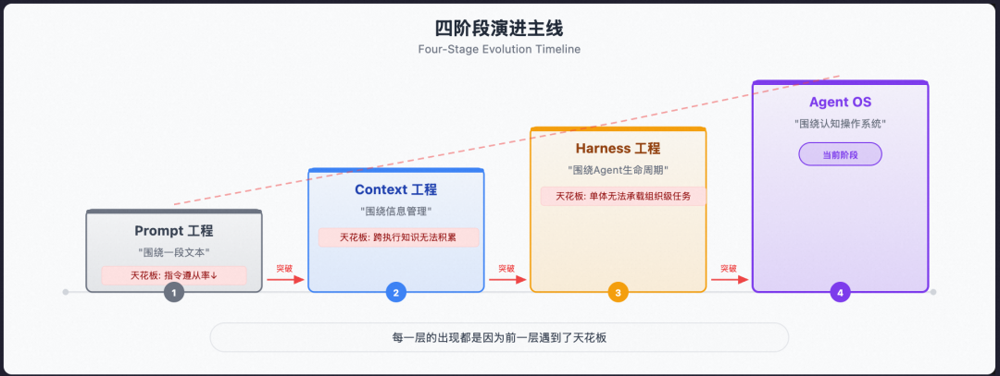
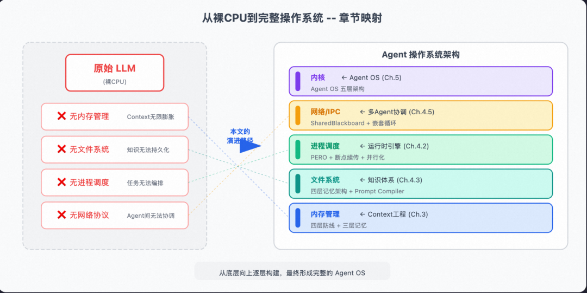
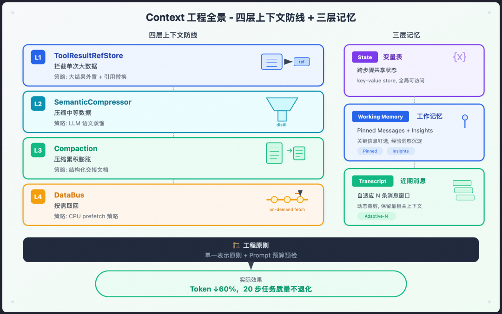
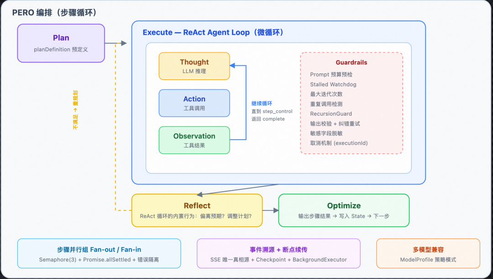
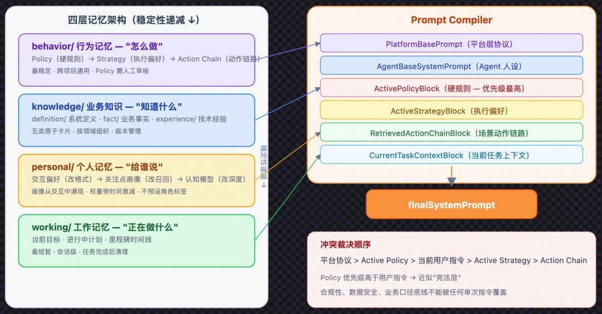
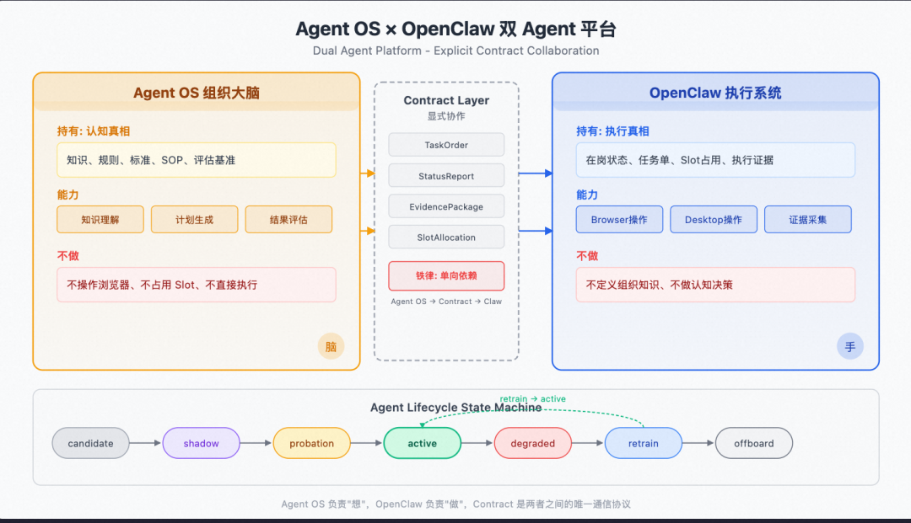
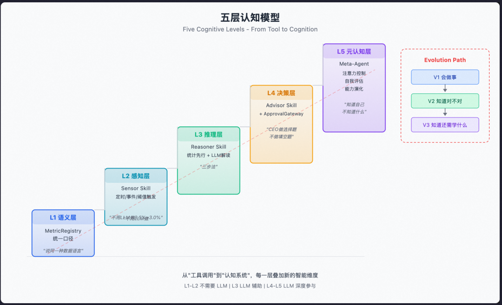

> 信源：微信公众号「千问AI平台」，作者储旭（槿柏），2026-07-19。[原文链接](https://mp.weixin.qq.com/s/xH4cyBJJJlG9cfcmSU5ztA)。内容是阿里千问 AI 平台构建企业级 Agent 平台的完整技术复盘：从大模型的四个结构性约束出发，经历 Prompt 工程 → Context 工程 → Harness 工程三个阶段，最终演化为五层架构的 Agent OS。每一层的出现都是因为前一层遇到了天花板。

关联阅读：[Harness Engineering](Harness%20Engineering.md)、[Context Engineering 10 问](../01-Foundations-%E5%9F%BA%E7%A1%80%E6%A6%82%E5%BF%B5/Context%20Engineering%20%E9%9D%A2%E8%AF%95%2010%20%E9%97%AE.md)、[OpenClaw架构与常见问题](../04-References-%E9%A1%B9%E7%9B%AE%E5%8F%82%E8%80%83/OpenClaw%E6%9E%B6%E6%9E%84%E4%B8%8E%E5%B8%B8%E8%A7%81%E9%97%AE%E9%A2%98.md)、[Claude Code 上下文管理与五层压缩](../02-Coding-Agents-%E7%BC%96%E7%A8%8B%E6%99%BA%E8%83%BD%E4%BD%93/Claude-Code-Internals-%E6%BA%90%E7%A0%81%E5%8E%9F%E7%90%86/%E4%B8%8A%E4%B8%8B%E6%96%87%E7%AE%A1%E7%90%86%E4%B8%8E%E4%BA%94%E5%B1%82%E5%8E%8B%E7%BC%A9.md)。

## 一、大模型的四个结构性约束

这四个约束不会因为模型变大、训练数据变多而消失，所有工程努力都是在这四面墙壁围成的房间里做文章。

1. **上下文窗口是稀缺资源**。一个 ReAct Agent 每步至少产生 3 条消息，5 步技能 × 每步 3 轮迭代就是 45+ 条消息；若工具结果是数万字符的 JSON，消息队列几轮内就膨胀到 200K+ 字符，超过 128K 物理上限。且不能简单截断：截断的 JSON 无法 parse；OpenAI 协议要求 `tool` 消息必须紧跟对应的 `assistant` `tool_calls`；20+ 轮后 LLM 会"遗忘"早期关键发现；被压缩的数据还需保留原文供审计回放。需要的不是"截断"，而是完整的**信息生命周期管理**。
2. **注意力稀释——"LLM 越跑越蠢"**。实测：同一个 Skill，3 步任务质量好，8 步明显下降，15 步几乎不可用。Dump 上下文发现真相：第 8 步时上下文 70% 是前几步工具返回的原始 JSON，20% 是历史消息，只有 10% 是当前步骤真正有用的信息。**物理容量 ≠ 有效容量**。且这是自我恶化循环：上下文膨胀 → 注意力稀释 → 参数错误率上升 → 更多重试消息 → 进一步膨胀。教训：不要用更大的模型掩盖工程问题——32K 升 128K 只是把天花板从第 5 步推迟到第 8 步。
3. **数据搬运谬误**。步骤 A 的输出由模型"搬运"到步骤 B 的参数中，模型可能截断长字符串、遗漏嵌套字段、混淆相似 UUID、或幻觉出不存在的 ID。典型失败：步骤 A 返回 15 个元素的数组，LLM 只搬运 3-5 个"代表性"元素——无意识的"摘要"对精确执行就是数据丢失。核心原则：**让 LLM 做它擅长的事（理解意图、规划、推理），让系统做它擅长的事（数据搬运、格式转换、精确传递）**。
4. **无状态的先天缺陷**。单次执行内：状态全靠上下文承载，进程崩溃即蒸发（LLM 只有"内存"没有"硬盘"）。跨执行：Agent 无法从历史执行中学习——昨天调三次才发现的坑，今天重新踩。知识在诞生的同时就开始遗忘。

结论：原始大模型只是一块"高性能裸 CPU"，没有内存管理、文件系统、进程调度。从 Prompt 到 Harness 的演进，就是为这块裸 CPU 逐个补齐操作系统的子系统。

## 二、Prompt 工程阶段

### 从角色扮演到结构化注入

最早期把所有信息塞进一段 System Prompt，最终演化为 500+ 行、10 个结构化章节的项目上下文注入文档（类 CLAUDE.md）：设计哲学、安全硬规则、路径映射表、API 端点注册表、知识体系目录等。本质是一种"持久化的 System Prompt 工程"，通过"上下文推断规则"实现轻量级 RAG（关键词触发，无需向量检索）。上限：每次对话全量注入约 15K-20K token，无论是否相关。

### Prompt Hack 的标语困境与 Attention 引导的极限

在工具 description 中用 `⚠️`、全大写、首尾位置（primacy/recency effect）注入格式规则，像工厂墙上的安全标语——依赖工人每次都阅读并遵守。实测：3 步任务规则遵从率约 95%，10 步以上跌到 70% 以下。这是一场赢不了的军备竞赛：**用"更多 token"对抗"token 太多"是火上浇油**。真正的出路在系统层面——让系统强制执行规则，而非让模型记住规则。

### S1（MVP）的三个结构性缺陷

S1 架构 = "工作流编排 + 单轮对话"，无 Agent/Skill/ReAct 概念。三个月跑通 MVP，活动举办效率提升 50%，但暴露三个结构性缺陷（不是 bug，是架构选择的必然后果）：

1. **没有容错，一断全崩**：纯内存 `while` 循环，无事件溯源无检查点。15 步任务第 12 步失败只能从头重跑（约 6 分钟）；用户关掉浏览器 → SSE 断开 → 结果无处推送。
2. **上下文膨胀最终爆炸**：工具返回完整塞入上下文，几轮逼近窗口极限，"越跑越蠢"无制动机制。
3. **执行完就结束，不会回头看**：单向管道不检查中间结果，10+ 步任务中错误在链路中放大，产出"形式上完成但逻辑不一致"的结果。

根因：S1 把 AI 当一次性脚本执行器，而不是有状态、能反思、能管理自身资源的智能运行时。

## 三、Context 工程阶段

核心判断：**上下文管理是需要分层防御的系统工程，不能指望单点优化**。不同粒度的膨胀（单次 50KB 爆发、5 步累积 200K+、30+ 轮渐进膨胀）需要不同的"拦截武器"。参考输入：ReAct（隐含假设上下文无限大，10 步以上即退化）、Claude Code 的 compaction 与渐进式披露、Codex 的大结果外置 + refId 引用。

### 四层上下文防线

按数据膨胀发生的时间顺序逐层拦截：

- **L1 工具结果压缩（ToolResultRefStore）——拦截单次大数据**。大结果外置 + 引用替换。三个触发条件：字符数 >8000、数组元素 >10（消除 LLM 搬运大数组时"无意识摘要"的篡改机会）、强制存储模式（`alwaysStore`）。大结果存 MySQL，消息中只留 `{"__stored":true,"__refId":...,"__summary":...,"__hint":"Call get_stored_data(...)"}` 引用对象。注意：存储记录中的 `preview` 字段（前 12000 字符）**永远不进入 LLM prompt**，仅用于审计/调试。
- **L2 语义压缩（SemanticCompressor）——压缩中等数据**。单条结果 >10000 字符时，用另一个 LLM（temperature=0.3，而非 0——避免贪心解码退化；经线上 2000+ 次验证）蒸馏为 ≤2000 字符的高密度结论。原始数据保留 TTL 1 小时。降级策略：压缩失败时退化为结构化截断（JSON 包装 + `__fallbackTruncated` 标记），让 LLM 能识别"这是不完整数据"。**教训**：曾让 LLM 同时生成 summary 和 preview，结果 LLM"智能重写"改变了字段名和前缀，导致下游前缀匹配失败、腐败数据流入工具调用——preview 改用原始文本 `substring`。**在数据流转管道中，确定性永远优先于智能性**。
- **L3 对话压缩（Compaction）——压缩累积膨胀**。`prompt_tokens / contextWindow >= 85%` 触发（95% 可能输出空间不足），目标压到 30%（压缩有延迟，需留缓冲区）。产物不是自由摘要而是**结构化交接文档**（"交接而非丢弃"）：① 用户原始请求（防止"忘记初心"）；② 按阶段分组的执行历史（约束 LLM"保留具体的值、ID、名称，不要概括泛化"）；③ **已放弃的路径**（`~~方案~~：放弃原因`——直接防止重蹈覆辙）；④ 数据引用索引（所有 `__stored` refId 的迷你索引表）。边界安全：不能从 `tool` 消息开始截断（破坏 assistant-tool 配对），最少保留 6 条、最少删除 2 条。
- **L4 数据总线（DataBus）——补偿压缩后的按需取回**。在 system prompt 中维护全局数据索引表，根据步骤的 `input` 声明和 `{{variable}}` 引用做**声明式依赖分析**、按需预取（类比 CPU prefetch，但确定性、无 cache miss）。小数据（≤4096 字符）直接注入；大数据取回后生成保留结构信息的增强摘要（≤1000 字符）。严格预算控制，超预算按固定顺序降级：丢 preview → full → summary → 非直接依赖 → 收缩 transcript → 收缩 working memory（**越接近任务核心的信息越晚被牺牲**）。另有 Inspect Mode 工具（`outline` / `search` / `context` / `head/tail`）作为整块恢复的轻量替代。

### 单一表示原则

贯穿全局的"宪法条款"：**同一份上游数据在任一后续 step 的 LLM 上下文中只允许出现一种表示形态**。因为 LLM 面对同一数据的多种描述时不会取最精确的，而是花大量 token 交叉验证甚至幻觉。小数据（<8000 字符）唯一表示是 inline 完整对象；大数据唯一表示是 `artifact_ref`，二者互斥。工程实现：PromptBuilder 中做**组装前检查**，同一 refId 多形态共存直接拒绝组装并告警——"编译时"检查而非"运行时"祈祷。

### 三层记忆

与四层防线正交：防线负责"减少"，记忆负责"保留"（哪些信息必须跨步骤存活）。

- **State（变量表）**：跨步骤 key-value 存储，确定性数据通道——Step A 写入、Step B 读取，不经过 LLM 搬运，零损耗。
- **Working Memory**：**Pinned**（用户原始请求 + 当前计划，始终在上下文最前，对抗 20+ 步任务中的"目标漂移"）+ **Insights**（滚动关键发现，尾部逆序注入，模型可通过 `working_memory` 工具主动写入）。
- **Transcript**：最近 N 条消息，N 随步数自适应收缩（`keepTarget = round(36 - steps × 0.8)`：5 步≈32 条，30 步≈12 条）。动态平衡：Transcript 收缩时 Working Memory 反向扩张（insights 上限 40 条/8000 字符）——用结构化知识补偿对话历史的信息损失。类比人类：不记得上周三午餐的每句对话，但记得那天定了方案 B。

### Prompt 预算预检

调用 LLM 之前先估算上下文成本，超预算按固定顺序降级，仍超限则直接失败返回 `PROMPT_BUDGET_EXCEEDED`。**成本控制从事后统计提升为事前治理**——既省钱，更避免上下文过长导致的推理质量下降。在两个时机触发：每步迭代开始前、最终输出前。如果连 pinned 任务目标都放不下，直接失败比"硬跑但质量很差"更诚实。

### 效果与哲学

Token 消耗降低 60%+；从 S1 的"8 步衰减、15 步不可用"到 S2 的"30+ 步稳定执行"。三条设计哲学：分层拦截优于全能方案；确定性优于智能性；事前治理优于事后修复。

## 四、Harness 工程阶段

Context 工程是给 LLM 装了"内存管理"，Harness 工程则是完整的"操作系统"：进程调度（PERO + 断点续传）、文件系统（四层记忆架构）、IPC（SharedBlackboard）、安全机制（RecursionGuard）、自我进化（Self-Feedback Engine）。

### 设计哲学：从防御到赋能

早期引擎每次工具调用经过五层修复管道（修复截断参数 → 注入上下文数据 → 声明式绑定 → 自动恢复引用 → 标准化格式），约 500 行代码占 ToolExecutor 核心逻辑近 50%。防御范式的代价：维护成本超过被保护的核心逻辑；性能税（20 次工具调用带来 40-100 次"以防万一"的 DB 查询）；**进化阻力——系统越"健壮"，越难从模型进步中获益**（类比 McGregor X/Y 理论）。

| 防御范式 | 赋能范式 | 管理学隐喻 |
| --- | --- | --- |
| 5 层修复管道 | `parameterBindings` 声明式绑定 | 审批流程 vs 流程设计 |
| 隐式信号判断（纯文本 = 完成？困惑？） | `step_control` 工具（显式表达 complete/skip/need_info） | 猜测员工想法 vs 建立沟通机制 |
| 系统控制记忆 | `working_memory` 工具（模型自主记录） | 替员工做笔记 vs 给员工笔记本 |
| 全量工具暴露 | Action Space 动态裁剪 | 考验自制力 vs 优化工作环境 |

- **parameterBindings**：步骤 B 需要步骤 A 的输出，就在技能定义时声明绑定，运行时直接注入——消除错误发生的条件，而非事后兜底（Deming：质量问题的根源在系统，不在工人）。
- **step_control**：纯文本可能意味着"完成/思考/困惑/解释"四种状态。没有表达"我卡住了"的工具，模型只能用沉默暗示，而系统把沉默解读为"完成"（Wittgenstein：语言的界限就是世界的界限）。
- **working_memory**：模型主动提取记录的信息比系统注入的更可能被正确使用（"生成效应"）。对应 Anthropic 上下文管理演进三阶段：RAG（灌入）→ Grep（搜索）→ Progressive Disclosure（逐层发现）。
- **Action Space 动态裁剪**：根据步骤进展只暴露有意义的工具（无 `__stored` 对象时不注入 `get_stored_data`，最后一步不注入 `working_memory`）——Thaler 的"助推"：改变选择架构而非限制自由。

渐进式迁移三阶段：可观测性先行 → 声明式绑定替代命令式修复 → 赋予模型表达和记忆能力。原则：**先减少模型犯错的机会，再增加模型做对的能力**。信任不是一种态度，而是一种设计能力。

### Agent 运行时引擎

- **PERO 编排**（Plan-Execute-Reflect-Optimize）：Plan 由 Skill 的 `planDefinition` 预定义；Execute 由 ReAct Agent Loop 驱动；Reflect/Optimize 是 ReAct 循环的内禀行为而非独立环节。不用 Tree-of-Thought：工具密集型任务中分支探索成本太高（每个分支都要真实调外部服务），单路径执行 + 每步自然反思是最优范式。
- **单步 ReAct 微循环**：LLM 响应分三类——`tool_calls`（继续循环）/ `content`（步骤完成，写 State 进下一步）/ 无有效响应（注入错误提示重试）。两道硬约束：Prompt 预算预检 + stalled watchdog（LLM 超时标记 `LLM_STALLED`）。输出校验采用"迭代式 prompt refinement"——把错误信息注入上下文让 LLM 自我纠正，而非系统替它修复。
- **有状态执行与断点续传**：核心是**执行与推送分离**——BackgroundExecutor 独立运行，每个事件写入 DB，**SSE 事件流作为执行状态的唯一真相源**（前端思维链、断点续传、审计日志全部从同一事件流派生）；SSE 断开不影响执行，重连后 poll 增量事件。关键节点触发 checkpoint，恢复时优先缓存快照、兜底事件溯源。效果：15 步任务第 12 步失败，从重跑 6 分钟变为断点恢复 30 秒。
- **步骤并行化**：Fan-out/Fan-in，`Promise.allSettled` 错误隔离 + `Semaphore` 限流（默认 3）。选择**配置驱动的并行组**而非 LLM 自主并行（可控性 vs 灵活性的 trade-off）。踩坑：并行仅用于"输入完全确定、互不引用"的子任务——逻辑上独立的步骤可能有隐含数据依赖（COT 详情需要执行记录返回的 executionId）。
- **可靠性护栏**：最大迭代次数、重复工具调用检测、RecursionGuard（深度 ≤5、链路 ≤20、同一 skillId 出现 ≥3 次环检测，三重硬拦截）、取消机制、敏感字段脱敏、单一表示检查。生产安全不能依赖 LLM 的"自觉"。

### 知识体系：四层记忆架构

按"稳定性递减、时效性递增"分四层（与 System Prompt > Few-shot > User Message 的优先级一致）：

- **行为记忆（behavior/）——"怎么做"**：踩坑教训、持久决策、设计规范。细分为 Policy Memory（硬规则，**优先级高于用户指令**，必须人工审核，近似"宪法层"）、Strategy Memory（执行偏好，可自动优化）、Action Chain Memory（高频动作链路）。冲突裁决顺序：平台协议 > Active Policy > 当前用户指令 > Active Strategy > Retrieved Action Chain。
- **业务知识（knowledge/）——"知道什么"**：系统定义、业务事实、技术经验，按领域组织、版本管理。
- **个人记忆（personal/）——"给谁说"**：三层递进——交互偏好（改响应格式）→ 关注点画像（改召回权重，从交互中涌现、权重带时间衰减、不预设角色标签）→ 认知模型（改解释深度与论证结构）。从"对所有人说同样的话"到"对每个人说他需要听的话"。
- **工作记忆（working/）——"正在做什么"**：当前目标、进行中计划、里程碑时间线。

**Prompt Compiler**：存储和修正的对象不是 Prompt 文本，而是结构化行为记忆资产；最终 System Prompt = PlatformBase + AgentBase + ActivePolicy + ActiveStrategy + RetrievedActionChain + CurrentTaskContext。每个 Patch 有独立适用范围、置信度、命中率和成功率。

### 进化体系：Self-Feedback Engine

静态知识库会老化。自进化闭环要求 Agent 每次任务后回答三个自省问题：学到新东西了吗？犯错了吗？知识体系有过时内容吗？答案按类型路由写入 behavior/、decisions.md、knowledge/。约束：不记临时状态、不存代码 diff 原文（记结论不记过程）、不确定不猜测性写入。

工程实现五组件：Trace Collector → Outcome Evaluator（correct/incorrect/partial/harmful）→ Root Cause Analyzer（归因到 policy/strategy/chain/execution 四层）→ Patch Generator（结构化 patch，非自由文本）→ Safety Gate（自动生效/灰度/待审核）。Patch 状态机：`draft → shadow → active → expired`；Strategy 和 Action Chain 可自动升级，**Policy 必须人工审核**。成功率持续追踪，100 次命中只有 30% 成功的 strategy 自动标记 expired。

三条闭环：执行闭环（已闭合）、学习闭环（成型中）、治理闭环（推进中）。

### Capability Runtime 与多 Agent 协调

- 从 Skill-first 到 **Capability-first**：Agent 持有 `capabilityConfig`，支持 skill、builtin_tool、service_tool、workflow_tool、mcp_tool、tool_pack 六种 kind，统一解析为 `ToolDefinition` 调度。三原则：Agent-first、Tool-first Execution、Artifact-first。
- 多 Agent 树形结构（CEO 级 → 主管级 → 执行 Agent，最深 5 层）：SiliconEmployeeRunner 四阶段循环 Plan → Dispatch（拓扑排序，sequential/parallel/adaptive）→ Reflect → Synthesize。跨 Agent 状态共享用 **SharedBlackboard**（MySQL + 内存缓存，read/write/subscribe）。
- **四层嵌套循环**：微循环（ReAct，秒级）⊂ 步骤循环（PERO）⊂ 任务循环（Silicon Employee）⊂ 组织循环（OODA，小时到天，整个系统的"心跳"）。外层循环的一个"动作"展开就是内层循环的完整生命周期。

## 五、Agent OS 五层架构

- **L1 OpenClaw 执行集群层**（类比 HAL）：Control Plane（Slot 编排、标签匹配路由）、Bridge Runtime（节点常驻进程）、Gateway Runtime（认证限流）、Mac 节点/Slot 池（浏览器+Shell+文件系统的隔离环境）。关键决策：**Slot 是无状态执行单元**，任务状态在 L2 执行账本中——Slot 可回收可迁移，断点续传延伸到分布式环境。
- **L2 Agent Runtime 层**：自由对话引擎 + ReAct Skill 引擎 + PERO Step 引擎 + 执行账本（事件溯源）+ SSE 事件流 + 断点续跑。特性：**执行模式自适应切换**——按意图复杂度评分，简单查询走对话模式，复杂操作自动升级为 PERO 编排，用户无感。
- **L3 记忆与语义层**：三层记忆 + DataProductStore 共享黑板（带语义标签的数据产物，支持**基于意图的检索**而非 key 精确匹配——从"文件系统"到"知识图谱"的跃迁）。
- **L4 Agent OS 认知层**：感知（Sensor Skill 监听异常信号）→ 判断（Reasoner Skill 归因）→ 调度（Silicon Employee 分派）→ 评估（闭环验证）。核心创新是**注意力经济**：注意力控制器维护动态优先级队列，只让最重要的信号进入认知处理通道。
- **L5 自主进化与治理层**：训练（Knowledge Pack → Skill Bundle）→ 评测（Eval Run）→ 认证 → 发布（灰度）→ 值班 → 告警 → 修正 → 回流。设计哲学：**Agent 的进化应该像软件发布一样被治理**——Strategy/Action Chain 允许自动进化（快速适应），Policy 必须人工审核（守住底线）。

系统的一等对象不是 workspace/terminal/tool list，而是 execution request / workflow context / planDefinition / execution ledger / governance contract——做的不是"通用 Agent 工具云化"，而是**业务执行范式工程化**。

### 云端 Agent OS × OpenClaw 双 Agent 平台

核心认知：**思考和执行是两种根本不同的能力，混在一起会互相拖累**。云端 Agent OS 持有认知真相（知识、规则、标准），OpenClaw 持有执行真相（在岗状态、任务单、Slot 占用），通过显式 Contract Layer 协作。铁律：Agent OS 不修改运行中 slot 状态，OpenClaw 不修改组织知识真相。

Contract Layer 四种契约：TaskOrder（结构化任务单）、StatusReport（执行状态回报）、EvidencePackage（执行证据）、SlotAllocation（资源分配协议）。最大价值：**认知层和执行层可以独立演化**——换更强的推理模型只升级 Agent OS，新增执行环境只扩展 OpenClaw。

Agent 发布状态机：`candidate → shadow → probation → active → degraded → retrain → offboard`。`shadow` 期间接收真实任务但结果不生效（类比 A/B 测试）；`probation` 结果生效但人工兜底；连续失败超阈值自动 `degraded`。

### 与 Claude Code 的本质差异

1. **一等对象不同**：千问平台是带业务上下文的 Execution Request（携带 planDefinition、parameterBindings、knowledge scope、governance contract）、workflow 编排器、类型化数据流转、结构化审计计费；Claude Code 是 workspace、session、tools、subagents。
2. **数据流转范式不同**：显式状态流转（参数绑定、context path 提取、outputMode、inputMaterialization、inheritedContext）保证多步骤多 Agent 嵌套中**零损耗**；Claude Code 靠模型记忆，3-5 步够用，15+ 步业务流程会因数据搬运谬误崩溃。
3. **知识定位不同**：知识是**强规则执行面**（按业务域限定范围、预召回+运行时检索、命中结果继承给子 Skill、违反时拒绝执行）；CLAUDE.md 是"建议"性质的上下文参考，模型可以选择忽略。

总结：Claude Code 解决"个人开发者如何更高效地编程"，千问平台解决"组织如何将业务流程可靠地委托给 AI 执行"。前者容错靠人类兜底，后者容错必须内建于系统。

### 五层认知模型：从工具型到认知型

- **L1 语义层**：MetricRegistry 统一指标口径 + 版本管理。最低技术但最关键——口径不一致则上层感知推理都建立在沙子上。
- **L2 感知层**：Sensor Skill 三种触发（定时/事件/阈值）。关键决策：**阈值判断用 `execute_code` 而非 LLM**——"3.5% > 3.0%"不需要花 token，LLM 预算留给真正需要"理解"的任务。另有降噪职责（合并、去重、优先级标注）。
- **L3 推理层**：Reasoner Skill 三步法——统计归因（代码跑同比/环比/异常检测，确定性结论）→ LLM 叙述解读（语义关联，可能错但有价值）→ 置信度标注（high/medium/low，供决策层决定自动执行还是人工确认）。
- **L4 决策层**：Advisor Skill 产出结构化决策卡片（一句话问题 + 影响面量化 + 2-3 个方案选项），"CEO 做选择题不做填空题"。ApprovalGateway 三种模式：严格审批/阈值审批/事后追认（按可逆性和影响面选择）。
- **L5 元认知层**：注意力控制器（动态分配采集频率）、自我评估引擎（回溯验证校准置信度偏差）、能力演化引擎（识别能力盲区并提议新 Skill——"知道自己不知道什么"）。

演进路径：V1 会做事 → V2 知道做得对不对 → V3 知道还需要学什么。

## 六、五条核心认知

1. **"LLM 越跑越蠢"是工程问题，不是模型问题**。上下文 70% 噪音稀释注意力，换更大模型没用。实践：先看上下文质量再考虑换模型——模型换一轮指标没变，上下文管理做一周指标提升 40%。
2. **上下文管理是分层防御的系统工程**。没有银弹，四层各管一段；分层还降低单层复杂度（单一职责，同微服务哲学）。
3. **Agent 的动作空间必须被治理，能力应以演化方式出现**。工具从 5 增加到 50 不是能力增强 10 倍，而是选择困难增加 10 倍。渐进式披露既优化 token economy，也定义了 Agent 有节奏的成长路径。
4. **工具设计有半衰期**。模型升级后旧防御机制变成不必要的约束：S1 时参数遵从率 70%，五层修复管道必需；S2 中期遵从率 90%+，其中三层触发率 <5%。系统应能从模型进步中"免费"获益——这就是"可观测性先行"的意义。
5. **信任建立不能跳过人工确认**。95% 准确率剩下 5% 的错误足以摧毁整个系统的信任：信任建起来需要连续 20+ 次正确，毁掉只要一次。所以要有 `shadow`/`probation` 阶段，ApprovalGateway 要分级——验证 1000 次没出错的操作类型可逐步放开自动化。

## 结语

> Agent 系统设计的本质不是控制 LLM 的行为，而是为 LLM 创造一个"犯错成本最低、正确路径最短"的执行环境。

"犯错成本最低"：错误发生时有检查点可回退、有结构化失败记录防止重蹈覆辙、有自动降级而非整体崩溃。"正确路径最短"：Action Space 裁剪减少无效选项、parameterBindings 消除数据搬运、DataBus 预取让信息唾手可得。从防御到赋能，区别不在控制的松紧，而在控制的方向——前者"堵住错误的出口"，后者"打开正确的入口"。

四个结构性约束没有消失，但已从"天花板"变成"设计约束"。约束不是敌人，约束是创造力的起点。
